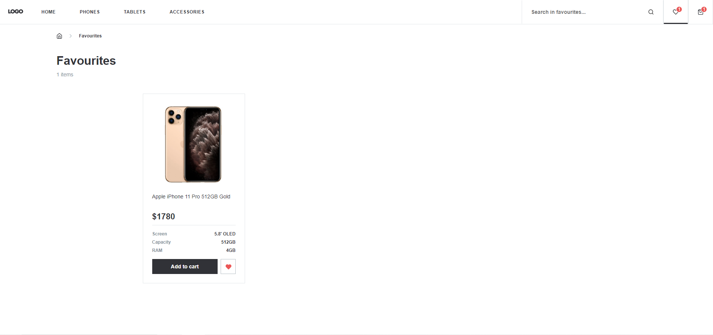
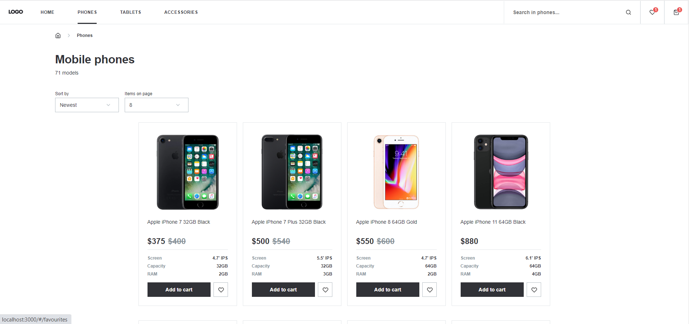
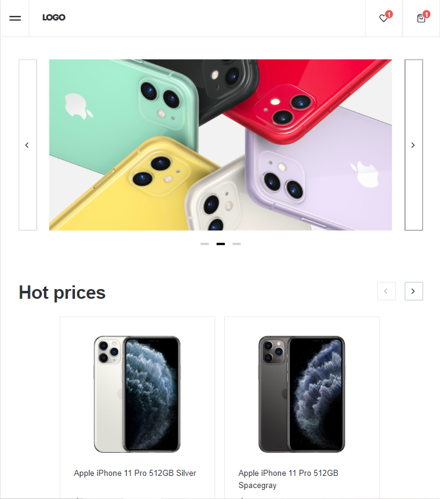

# Phones catalog E-store 

Mock concept for online shopping. Features multiple shopping categories and products for purchase, has a cart screen to display all products ready for checkout and favourite items screen.
Implemented responsive template for desktop computers, tablets and mobile devices.

## DEMO
[DEMO LINK](https://Ir-ra.github.io/e-store_phone/)

## Mockup link
[mockup](https://www.figma.com/file/uEetgWenSRxk9jgiym6Yzp/Phone-catalog-redesign?node-id=1%3A2&mode=dev)

## Technologies
Project is created with:
* React
* Type Script
* SCSS Preprocessor
  
## Screenshots

